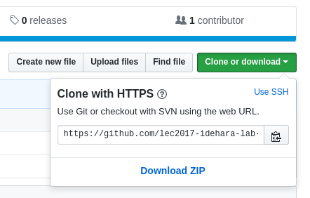

# 第01回 環境を構築する

## 今回用いる環境

* AWS(Amazon Web Services)
    * Elastic Compute Cloud(EC2)
    * Cloudformation
    * IAM
* Windows Server 2012 R2
* Java SE Development Kit 8
* IIS
* MySQL
* ~~Docker~~

* IntelliJ Idea 2016
* Node.js
* MySQL Workbench
* Git for Windows
* Chocolatey
* curl
* jq

## AWS環境を立ち上げる

http://xxx.xxx.xxx.xxx にアクセス

1. メールアドレスを(@tama.ac.jpより前)を入れ、環境構築をします。
1. 環境構築後メールが送付されます。


## 自己紹介

ブログの会社に所属しているエンジニアです。  
以前は、フロントエンドを主に実装していました。  
最近は、会社の方針変更もあり、ビックデータ基盤の構築等を担当しています。

## この授業の目的

```
昨今開発されている、WEBアプリケーション開発においては、様々なツールやインターネット上で提供されているサービスやAPI を用いて構築が行われている。
このプロジェクトゼミでは、実際の開発の現場で使われているツールや技法を学び、実践として、それらを用いてPC やスマートフォンから利用するWeb アプリ開発を行う。
また構築を通じて、Webアプリケーションの仕組みを理解し、Web アプリケーション活用・開発のスキル習得を目標とする。　　
``` 

## アンケート記入のお願い

[モダンWebプログラミング受講に関する質問](https://goo.gl/forms/7FahXhR5xLXUB1lr1)

## Windows環境にログイン

1. リモートデスクトップ接続のアプリケーションを立ち上げます
1. メールに記されている内容を元に、立ち上げた環境にログインします。

## はじめてのJava

[しがないOLのはじめてのJava ｜ Developers.IO](http://dev.classmethod.jp/server-side/java/first_java_-preparation/)

### JDKのインストール

上記では、JDKダウンロードしてきていれていますが、パッケージ管理の仕組みを用いることでダウンロード等することなく導入が可能です。

[Windowsでもパッケージ管理がしたい ｜ Developers.IO](http://dev.classmethod.jp/server-side/os/windows-packagemanagement/)

PowerShellを管理者権限で立ち上げ、以下のコマンドを入力します。

``` PowerShell
Find-PackageProvider -ForceBootstrap
Find-Package -ForceBootstrap -Name jdk8 -Provider chocolatey
Install-Package -Name jdk8 -Force
```

### エディタのインストール

Window標準のメモ帳でプログラミングをするのはきびしいので、
VisualStudioCodeを導入します。

先ほどのJDKを入れたのと同様に以下のコマンドを入力することでインストール可能です。

``` PowerShell
Install-Package -Name VisualStudioCode -Force
```

## はじめてのGit/Github

1. Gitをインストールします。

``` PowerShell
Install-Package -Name git.install -Force
```

1. Githubのアカウントを作成します。

[Githubのアカウント作成方法 - Qiita](http://qiita.com/rshibasa/items/f62db870ed573ca4dced)

1. Github for classroomの、初回リポジトリに参加します。

[01回授業招待リンク](https://classroom.github.com/assignment-invitations/76c38f476e6db13ae47f0207d5339369)

1. Git for bashを開き上記のリポジトリより、ソースコードの習得を行います。

    * Gitリポジトリの初期化

    ``` PowerShell
    git init
    ```

    * リポジトリURLの取得
    

    * ソースコードの取得

    ``` PowerShell
    git clone [クローンしたいリポジトリ]
    ```
1. 挙動の確認
    ブログの内容を確認してみて下さい

1. ソースコードの変更を実施
    文言の変更やロジックの追加等をなってみてください

1. 作業結果のローカルでのコミット

```
git add -A
git commit -m "メッセージ"
```

1. ローカルコミットの反映

```
git push origin master
```
